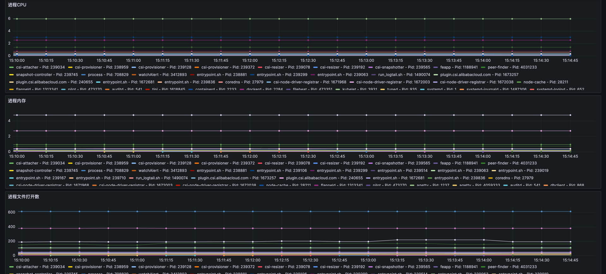

# Node-Process-Exporter

---
这是一个监控主机进程的exporter，用于分析主机进行的资源使用情况；通常在节点资源突然暴增时能够通过大盘快速定位到相应的 process。

## 运行 exporter
``` 
apiVersion: apps/v1
kind: DaemonSet
metadata:
  labels:
    app: node-process-exporter
  name: node-process-exporter
  namespace: kube-system
spec:
  selector:
    matchLabels:
      app: node-process-exporter
  template:
    metadata:
      labels:
        app: node-process-exporter
    spec:
      containers:
      - image: cairry/node-process-exporter:latest
        imagePullPolicy: IfNotPresent
        name: node-process-exporter
        ports:
        - containerPort: 9002
          hostPort: 9002
          protocol: TCP
        resources:
          limits:
            cpu: "1"
            memory: 1Gi
          requests:
            cpu: 250m
            memory: 512Mi
        securityContext:
          privileged: true

      hostIPC: true
      hostNetwork: true
      hostPID: true
      restartPolicy: Always

---
apiVersion: v1
kind: Service
metadata:
  name: node-process-exporter
  namespace: kube-system
spec:
  ports:
  - port: 9002
    protocol: TCP
    targetPort: 9002
  selector:
    app: node-process-exporter
  sessionAffinity: None
  type: ClusterIP
```
## Metric 格式
``` 
# HELP describe_node_process_cpu_info node process cpu monitor
# TYPE describe_node_process_cpu_info gauge
describe_node_process_cpu_info{cmd="/app/process",name="process",pid="1008428",user="root"} 1.625085769769547

# HELP describe_node_process_memory_info node process memory monitor
# TYPE describe_node_process_memory_info gauge
describe_node_process_memory_info{cmd="/app/process",name="process",pid="1008428",user="root"} 0.03518591615313425

# HELP describe_node_process_openfiles_info node process openfiles monitor
# TYPE describe_node_process_openfiles_info gauge
describe_node_process_openfiles_info{cmd="/app/process",name="process",pid="1008428",user="root"} 9

```

## Prometheus 配置
``` 
    - job_name: node-process-exporter
      honor_timestamps: true
      scrape_interval: 30s
      scrape_timeout: 10s
      metrics_path: /metrics
      scheme: http
      relabel_configs:
      - source_labels: [__address__]
        separator: ;
        regex: (.*):9002
        replacement: $1
        action: keep
      kubernetes_sd_configs:
      - role: endpoints
```

## 示图
导入 ./dashboard.json

